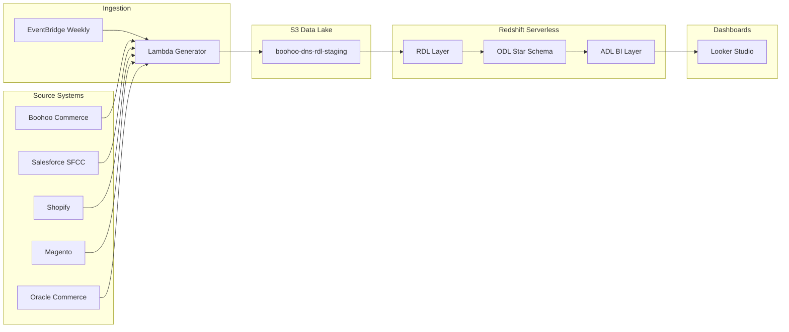
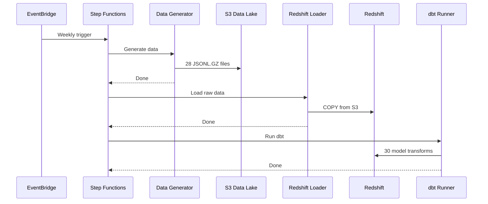
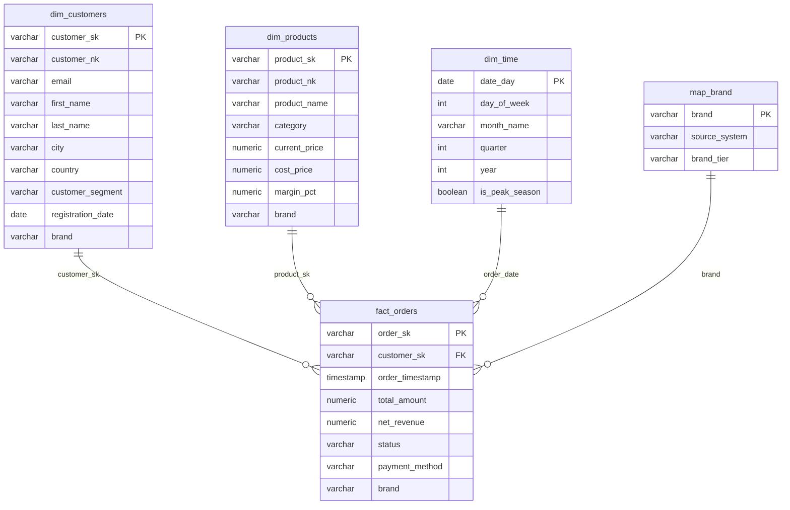
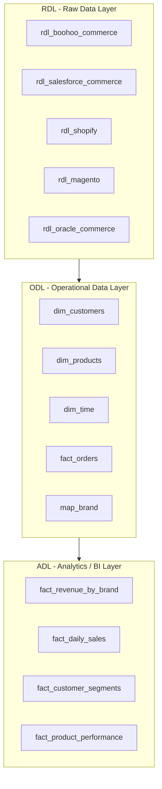

# 🏗️ Boohoo Group — Enterprise Data Pipeline

**Multi-brand, multi-source serverless data warehouse on AWS**


*A production-grade data engineering pipeline that ingests data from 7 fashion brands — each running a different e-commerce platform — normalises heterogeneous schemas through a 3-layer DWH architecture, and delivers unified analytics.*

---

## 📐 Architecture



### Orchestration Flow



---

## 📊 Data Model

### Multi-Brand Portfolio

This pipeline simulates a real-world enterprise challenge: **7 acquired brands** running on **5 different e-commerce platforms**, each with its own schema conventions.

| Brand | Source System | ID Field | Price Field | Orders |
|-------|-------------|----------|------------|--------|
| **Boohoo** | Boohoo Commerce | `sku` | `selling_price` | 15,000 |
| **BoohooMAN** | Boohoo Commerce | `sku` | `selling_price` | 8,000 |
| **PrettyLittleThing** | Salesforce Commerce | `product_id` | `price_book_price` | 12,000 |
| **NastyGal** | Shopify | `variant_id` | `price` | 6,000 |
| **Karen Millen** | Magento | `entity_id` | `price` | 4,000 |
| **Coast** | Magento | `entity_id` | `price` | 3,000 |
| **Debenhams** | Oracle Commerce | `item_id` | `list_price` | 7,000 |

> **The DWH challenge:** Each platform uses completely different field names for the same concept. The RDL layer normalises these into a single unified schema.

### Star Schema (ODL)



---

## 🏛️ DWH Layers (RDL → ODL → ADL)



| Layer | Schema | Purpose | Models |
|-------|--------|---------|--------|
| **RDL** | `rdl_{source}` | Raw data dedup from `_history` tables. Source field names aliased to unified names. | 21 |
| **ODL** | `odl` | Star schema with surrogate keys (`_sk`), natural keys (`_nk`), conformed dimensions, calculated metrics. | 5 |
| **ADL** | `bi` | Pre-aggregated materialised tables optimised for BI tool queries. | 4 |

### Schema Normalisation Example

The same "product ID" concept across 5 platforms:

```
Boohoo Commerce:   sku           → product_id
Salesforce SFCC:   product_id    → product_id  
Shopify:           variant_id    → product_id
Magento:           entity_id     → product_id
Oracle Commerce:   item_id       → product_id
```

---

## 🗂️ S3 Data Lake Structure

```
s3://boohoo-dns-rdl-staging/
├── boohoo/boohoo_commerce/
│   ├── customers/history/ingest_date=2026-05-09/customers.jsonl.gz
│   ├── products/history/ingest_date=2026-05-09/products.jsonl.gz
│   ├── orders/history/ingest_date=2026-05-09/orders.jsonl.gz
│   └── order_items/history/ingest_date=2026-05-09/order_items.jsonl.gz
├── prettylittlething/salesforce_commerce/...
├── nastygal/shopify/...
├── karen_millen/magento/...
├── coast/magento/...
└── debenhams/oracle_commerce/...
```

**Path pattern:** `{brand}/{source}/{dataset}/history/ingest_date={yyyy-mm-dd}/{dataset}.jsonl.gz`

---

## 🛠️ Tech Stack

| Layer | Technology | Purpose |
|-------|-----------|---------|
| **Orchestration** | EventBridge + Step Functions | Weekly scheduling + state management |
| **Compute** | AWS Lambda (Python 3.12) | Data generation, loading, dbt execution |
| **Storage** | Amazon S3 (JSONL.GZ) | Partitioned data lake with Hive-style paths |
| **Warehouse** | Redshift Serverless | Auto-scaling columnar analytics engine |
| **Transformation** | dbt Core | 30 SQL models across 3 layers |
| **Infrastructure** | AWS CDK (Python) | Infrastructure as Code |
| **BI** | Google Looker Studio | Interactive dashboards from ADL |
| **Showcase** | Apache Airflow DAG | Portfolio orchestration demo |

---

## 📁 Project Structure

```
boohoo-data-pipeline/
│
├── lambda/
│   ├── data_generator/         # 7 brands × 4 datasets (config.py + handler.py)
│   └── redshift_loader/        # COPY from S3 with manifest files
│
├── dbt/
│   ├── dbt_project.yml         # Layer → schema mapping
│   └── models/
│       ├── rdl/                # Raw Data Layer (21 models)
│       │   ├── boohoo_commerce/     → sku → product_id
│       │   ├── salesforce_commerce/ → product_id → product_id
│       │   ├── shopify/             → variant_id → product_id
│       │   ├── magento/             → entity_id → product_id
│       │   └── oracle_commerce/     → item_id → product_id
│       ├── odl/                # Operational Data Layer (5 models)
│       │   ├── dim/            #   dim_customers, dim_products, dim_time
│       │   ├── fact/           #   fact_orders
│       │   └── map/            #   map_brand
│       └── adl/bi/             # Analytics Data Layer (4 models)
│
├── airflow/dags/               # Showcase Airflow DAG
├── cdk/stacks/                 # CDK infrastructure
├── sql/                        # DDL + views
└── scripts/                    # Deploy / teardown helpers
```

---

## 🚀 Quick Start

```bash
# Clone
git clone https://github.com/TimiOlayinka/boohoo-data-pipeline.git
cd boohoo-data-pipeline

# Install
pip install -r requirements.txt

# Deploy
cdk bootstrap && cdk deploy

# Generate data
python lambda/data_generator/handler.py

# Run dbt
cd dbt && dbt deps && dbt run && dbt test
```

---

## 💰 Cost Estimate

| Service | Monthly | Notes |
|---------|---------|-------|
| S3 | ~$0.01 | < 50MB JSONL.GZ |
| Lambda | ~$0.00 | Free tier |
| Redshift Serverless | ~$0.50–2.00 | Auto-pauses when idle |
| Step Functions | ~$0.00 | 4 transitions/week |
| Secrets Manager | $0.40 | 1 secret |
| **Total** | **~$1–3/month** | |

---

## 🗺️ Roadmap

- [x] Multi-brand data generator (7 brands, 5 source systems)
- [x] S3 data lake with Hive-style partitioning
- [x] dbt project (30 models: RDL → ODL → ADL)
- [x] Airflow DAG (portfolio showcase)
- [ ] Redshift Serverless provisioning
- [ ] COPY + manifest ingestion pipeline
- [ ] Step Functions orchestrator
- [ ] EventBridge weekly schedule
- [ ] Looker Studio dashboards

---

**Built by [Timi Olayinka](https://github.com/TimiOlayinka)** — Data Engineering & AI Automation
