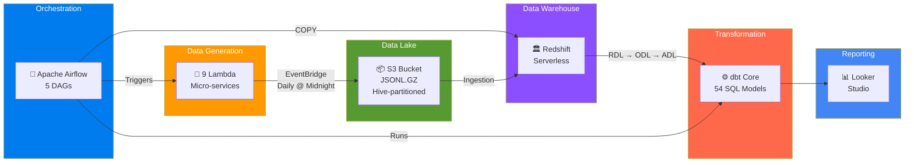
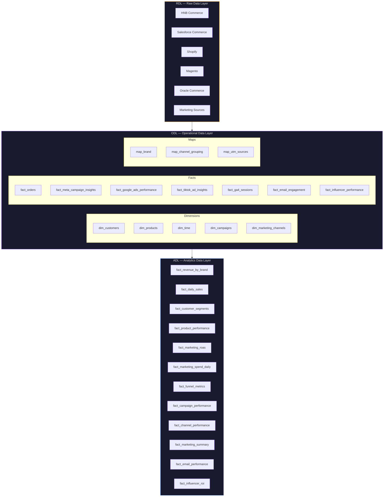
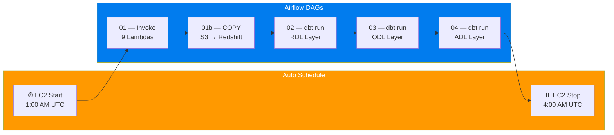

<p align="center">
  <h1 align="center">HNB Group — Enterprise Data Pipeline</h1>
  <p align="center">
    <strong>End-to-end data platform built on AWS, orchestrated with Airflow, deployed with Terraform, transformed with dbt, and visualised in Looker Studio.</strong>
  </p>
  <p align="center">
    
    
    
    
    
    
    
    
  </p>
</p>

---

## Architecture Overview

This project simulates a **production-grade marketing analytics platform** for HNB Group — a multi-brand fashion conglomerate operating 7 brands across 5 different e-commerce platforms. The entire cloud environment is defined as **Infrastructure as Code** using Terraform, orchestrated by **Apache Airflow**, deployed via **GitHub Actions CI/CD**, and follows a **three-layer data warehouse** pattern (RDL → ODL → ADL).



---

## Tech Stack

| Layer | Technology | Purpose |
|-------|-----------|---------|
| **Infrastructure** | Terraform | All AWS resources defined as code |
| **CI/CD** | GitHub Actions | Automated build, plan, and deploy on merge to `main` |
| **Compute** | AWS Lambda (Python 3.11) | 11 micro-services (9 data generators + 2 EC2 scheduler) |
| **Orchestration** | Apache Airflow 2.10.5 | 5 DAGs — ingestion, S3→Redshift COPY, and dbt layer runs |
| **Scheduling** | Amazon EventBridge | Daily cron triggers + Airflow EC2 auto start/stop |
| **Storage** | Amazon S3 | Hive-partitioned data lake (`JSONL.GZ`) |
| **Warehouse** | Redshift Serverless | Auto-scaling columnar analytics engine |
| **Transformation** | dbt Core | 54 SQL models across 3 warehouse layers |
| **BI** | Google Looker Studio | Executive dashboards from the ADL |

---

## Project Structure

```
aws-data-portfolio/
│
├── .github/
│   └── workflows/
│       ├── deploy_lambdas.yml         # CI/CD: Build → Terraform Init → Apply
│       ├── pr_title_checker.yml       # Enforces DATA-X/description branch naming
│       └── airflow_demo.yml           # Airflow demo workflow
│
├── airflow/
│   ├── config/                        # Airflow configuration
│   └── dags/                          # 5 orchestration DAGs
│       ├── 01_ingestion.py            # Invokes 9 Lambda data generators
│       ├── 01b_s3_to_redshift.py      # COPY from S3 → Redshift staging tables
│       ├── 02_transform_rdl.py        # dbt run — RDL layer
│       ├── 03_transform_odl.py        # dbt run — ODL layer
│       └── 04_transform_adl.py        # dbt run — ADL layer
│
├── hnb/
│   ├── lambda/                        # 11 independent Lambda functions
│   │   ├── ecommerce_customers/       # Customer data generator
│   │   ├── ecommerce_orders/          # Order & order item generator
│   │   ├── ecommerce_products/        # Product catalogue generator
│   │   ├── marketing_meta_ads/        # Meta Ads campaign data
│   │   ├── marketing_google_ads/      # Google Ads performance data
│   │   ├── marketing_tiktok_ads/      # TikTok Ads engagement data
│   │   ├── marketing_ga4_sessions/    # GA4 web session data
│   │   ├── marketing_email_campaigns/ # Email/CRM campaign data
│   │   ├── marketing_influencers/     # Influencer partnership data
│   │   ├── ec2_start/                 # Airflow EC2 auto-start (scheduled)
│   │   ├── ec2_stop/                  # Airflow EC2 auto-stop (scheduled)
│   │   └── shared/                    # Shared utilities & config
│   │       ├── config/
│   │       │   ├── core.py
│   │       │   ├── ecommerce.py
│   │       │   └── marketing.py
│   │       ├── handler_logic.py
│   │       └── utils.py
│   │
│   ├── terraform/                     # Infrastructure as Code
│   │   ├── main.tf                    # Provider & backend config
│   │   ├── iam.tf                     # IAM roles & policies
│   │   ├── lambdas.tf                 # 9 Lambda data generators (for_each)
│   │   ├── ec2.tf                     # Airflow EC2 instance + IAM + bootstrap
│   │   ├── ec2_scheduler.tf           # EC2 auto start/stop Lambdas + EventBridge
│   │   ├── s3.tf                      # S3 buckets & lifecycle policies
│   │   ├── redshift.tf                # Redshift Serverless cluster (data source)
│   │   ├── variables.tf               # Input variables
│   │   └── outputs.tf                 # Resource outputs
│   │
│   ├── dbt/                           # Data transformation layer
│   │   ├── models/
│   │   │   ├── rdl/                   # Raw Data Layer (27 models)
│   │   │   │   ├── hnb_commerce/   #   HNB & HNBMAN (6 models)
│   │   │   │   ├── salesforce_commerce/ # PrettyLittleThing (3 models)
│   │   │   │   ├── shopify/           #   NastyGal (3 models)
│   │   │   │   ├── magento/           #   Karen Millen & Coast (6 models)
│   │   │   │   ├── oracle_commerce/   #   Debenhams (3 models)
│   │   │   │   └── marketing/         #   Multi-channel marketing (6 models)
│   │   │   ├── odl/                   # Operational Data Layer (15 models)
│   │   │   │   ├── dim/               #   5 dimensions
│   │   │   │   ├── fact/              #   7 fact tables
│   │   │   │   └── map/               #   3 mapping tables
│   │   │   └── adl/                   # Analytics Data Layer (12 models)
│   │   │       └── bi/                #   12 pre-aggregated BI tables
│   │   ├── dbt_project.yml
│   │   └── packages.yml
│   │
│   ├── dist/                          # Built Lambda ZIP packages
│   │
│   └── scripts/
│       └── build_zips.py              # Packages Lambda code for Terraform
│
└── README.md
```

---

## Data Warehouse Layers

The warehouse follows an enterprise **RDL → ODL → ADL** pattern:



| Layer | Schema | Purpose | Models |
|-------|--------|---------|--------|
| **RDL** | `rdl_{source}` | Raw data deduplication. Source field names aliased to unified schema. | 27 |
| **ODL** | `odl` | Star schema with surrogate keys (`_sk`), conformed dimensions, calculated metrics. | 15 |
| **ADL** | `bi` | Pre-aggregated materialised tables optimised for dashboard performance. | 12 |

---

## Multi-Brand Challenge

This pipeline simulates a real-world enterprise challenge: **7 acquired brands** running on **5 different e-commerce platforms**, each with its own schema conventions.

| Brand | Source System | ID Field | Price Field |
|-------|-------------|----------|------------|
| **HNB** | HNB Commerce | `sku` | `selling_price` |
| **HNBMAN** | HNB Commerce | `sku` | `selling_price` |
| **PrettyLittleThing** | Salesforce Commerce | `product_id` | `price_book_price` |
| **NastyGal** | Shopify | `variant_id` | `price` |
| **Karen Millen** | Magento | `entity_id` | `price` |
| **Coast** | Magento | `entity_id` | `price` |
| **Debenhams** | Oracle Commerce | `item_id` | `list_price` |

> The RDL layer normalises these into a single unified schema before the data enters the star schema.

---

## Multi-Channel Marketing Analytics

The platform tracks marketing performance across **6 channels**, unifying spend, engagement, and attribution data into a single reporting layer:

| Channel | Source | Key Metrics |
|---------|--------|-------------|
| **Meta Ads** | Meta Marketing API | Spend, impressions, reach, CPM, CTR |
| **Google Ads** | Google Ads API | Spend, clicks, conversions, CPC, ROAS |
| **TikTok Ads** | TikTok Marketing API | Spend, video views, engagement rate |
| **GA4 Sessions** | Google Analytics 4 | Sessions, bounce rate, conversions, revenue |
| **Email/CRM** | Klaviyo / Mailchimp | Sends, opens, clicks, deliverability |
| **Influencer** | Manual / Partnership | Posts, reach, engagement, cost, ROI |

The ADL layer produces **cross-channel BI models** including:
- **`fact_marketing_roas`** — Return on Ad Spend by brand × channel × period
- **`fact_funnel_metrics`** — Full-funnel analysis: impressions → clicks → sessions → cart → purchase
- **`fact_marketing_spend_daily`** — Daily spend with 7-day and 28-day rolling averages
- **`fact_marketing_summary`** — Executive summary across all channels

---

## Airflow Orchestration

The entire pipeline is orchestrated by **Apache Airflow** running on a self-managed EC2 instance with automatic start/stop scheduling to minimise costs:



| Component | Details |
|-----------|---------|
| **Instance** | EC2 `t3.medium`, Amazon Linux 2023, 20 GB gp3 |
| **Runtime** | 3 hours/day (1:00 AM – 4:00 AM UTC) |
| **Auto start/stop** | 2 Lambda functions triggered by EventBridge cron rules |
| **DAG sync** | Pulls latest DAGs from GitHub on every boot via systemd |
| **IAM permissions** | Lambda invoke, Redshift Data API, S3 read access |

---

## Terraform Infrastructure

All AWS resources are declaratively managed via Terraform with remote state stored in S3:

| Resource | Terraform File | Description |
|----------|---------------|-------------|
| AWS Provider & S3 Backend | `main.tf` | Provider config, remote state |
| IAM Roles | `iam.tf` | `HNBDataGeneratorRole` with Lambda & S3 permissions |
| 9 Lambda Functions | `lambdas.tf` | Micro-service data generators using `for_each` |
| Airflow EC2 Instance | `ec2.tf` | Instance, security group, IAM role, bootstrap script |
| EC2 Auto Scheduler | `ec2_scheduler.tf` | Start/stop Lambdas + EventBridge cron rules |
| S3 Buckets | `s3.tf` | Data lake with versioning & lifecycle policies (Glacier @ 90d) |
| Redshift Serverless | `redshift.tf` | Auto-scaling warehouse (auto-pauses when idle) |
| Variables | `variables.tf` | Input variables |
| Outputs | `outputs.tf` | Resource ARNs, Airflow URL, SSH key |

---

## S3 Data Lake Structure

```
s3://hnb-dns-rdl-staging/
├── hnb/hnb_commerce/
│   ├── customers/history/ingest_date=2026-05-09/customers.jsonl.gz
│   ├── products/history/ingest_date=2026-05-09/products.jsonl.gz
│   ├── orders/history/ingest_date=2026-05-09/orders.jsonl.gz
│   └── order_items/history/ingest_date=2026-05-09/order_items.jsonl.gz
├── prettylittlething/salesforce_commerce/...
├── nastygal/shopify/...
├── karen_millen/magento/...
├── coast/magento/...
├── debenhams/oracle_commerce/...
└── marketing/
    ├── meta_ads/history/ingest_date=2026-05-09/meta_ads.jsonl.gz
    ├── google_ads/history/...
    ├── tiktok_ads/history/...
    ├── ga4_sessions/history/...
    ├── email_campaigns/history/...
    └── influencers/history/...
```

**Path pattern:** `{brand}/{source}/{dataset}/history/ingest_date={yyyy-mm-dd}/{dataset}.jsonl.gz`

---

## CI/CD Pipeline

Every push to `main` triggers an automated deployment via GitHub Actions:


| Workflow | Trigger | Purpose |
|----------|---------|---------|
| `deploy_lambdas.yml` | Push to `main` | Build ZIPs → Terraform init → apply |
| `pr_title_checker.yml` | Pull request | Enforces `DATA-X/description` branch naming convention |
| `airflow_demo.yml` | Manual / PR | Airflow demo workflow |

Branch protection rules enforce that **all changes must go through a Pull Request** — no direct pushes to `main` are permitted.

---

## Quick Start

```bash
# Clone
git clone https://github.com/TimiOlayinka/hnb-data-pipeline.git
cd hnb-data-pipeline

# Build Lambda packages
python hnb/scripts/build_zips.py

# Deploy infrastructure (requires AWS credentials)
cd hnb/terraform
terraform init
terraform plan
terraform apply

# Run dbt transformations
cd ../dbt && dbt deps && dbt run && dbt test
```

---

## Cost Estimate

| Service | Monthly | Notes |
|---------|---------|-------|
| S3 | ~$0.01 | < 50MB JSONL.GZ |
| Lambda (11 functions) | $0.00 | ~330 invocations/month (Free Tier: 1M) |
| EventBridge | $0.00 | Scheduled rules are free |
| Redshift Serverless | ~$0.50–2.00 | Auto-pauses when idle |
| EC2 (Airflow) | ~$3.50 | t3.medium, 3 hrs/day only |
| **Total** | **~$4–6/month** | |

---

**Built by [Timi Olayinka](https://github.com/TimiOlayinka)** — Data Engineering & AI Automation
