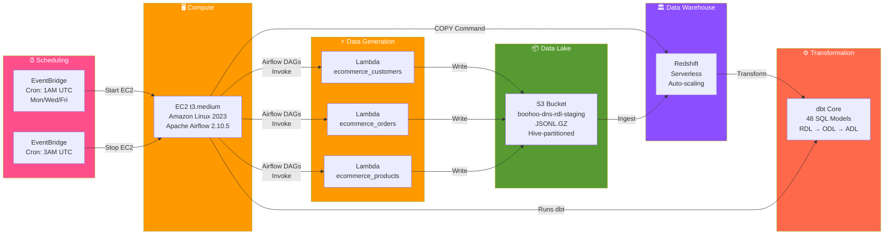
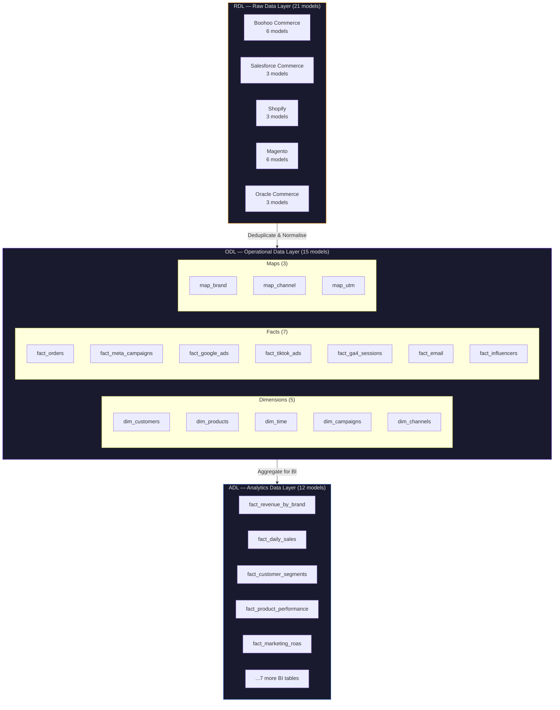
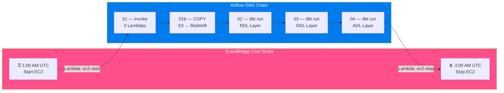

<p align="center">
  <h1 align="center">Boohoo Group — E-Commerce Data Pipeline</h1>
  <p align="center">
    <strong>Multi-brand e-commerce analytics platform on AWS — event-driven ingestion via EventBridge, orchestrated with Airflow on EC2, data generated by Lambda, stored in S3, warehoused in Redshift Serverless, and transformed with dbt.</strong>
  </p>
  <p align="center">
    
    
    
    
    
    
    
    
    
  </p>
</p>

---

## Architecture Overview

This project implements a **production-grade e-commerce data pipeline** for the Boohoo Group — a multi-brand fashion conglomerate operating **7 brands** across **5 different e-commerce platforms**. The pipeline follows a fully event-driven, serverless-first architecture:

**EventBridge → EC2 (Airflow) → Lambda → S3 → Redshift Serverless → dbt**



### How It Works

1. **EventBridge** fires a cron rule at **1:00 AM UTC** (Mon/Wed/Fri) → triggers a Lambda that **starts** the Airflow EC2 instance
2. **EC2 boots** → systemd syncs DAGs from GitHub → **Airflow** starts the pipeline
3. **Airflow DAG 01** invokes **3 Lambda functions** (customers, orders, products) → each generates multi-brand e-commerce data and writes to **S3** as `JSONL.GZ`
4. **Airflow DAG 01b** runs `COPY` commands to load S3 data into **Redshift Serverless**
5. **Airflow DAGs 02–04** run **dbt** transformations across 3 warehouse layers (RDL → ODL → ADL)
6. **EventBridge** fires at **3:00 AM UTC** → triggers a Lambda that **stops** the EC2 instance

---

## Tech Stack

| Layer | Technology | Purpose |
|-------|-----------|---------| 
| **Infrastructure** | Terraform | All AWS resources defined as code |
| **Scheduling** | Amazon EventBridge | Daily cron triggers + EC2 auto start/stop |
| **Compute** | EC2 `t3.medium` | Self-managed Apache Airflow orchestrator |
| **Orchestration** | Apache Airflow 2.10.5 | 5 DAGs — ingestion, S3→Redshift COPY, dbt layer runs |
| **Data Generation** | AWS Lambda (Python 3.11) | 3 e-commerce micro-services + 2 EC2 scheduler functions |
| **Storage** | Amazon S3 | Hive-partitioned data lake (`JSONL.GZ`) with Glacier archival |
| **Warehouse** | Redshift Serverless | Auto-scaling columnar analytics engine |
| **Transformation** | dbt Core | 48 SQL models across 3 warehouse layers |

---

## Project Structure

```
boohoo-data-pipeline/
│
├── lambda/                            # 5 Lambda functions
│   ├── ecommerce_customers/           # Customer data generator
│   │   └── handler.py
│   ├── ecommerce_orders/              # Order & order item generator
│   │   └── handler.py
│   ├── ecommerce_products/            # Product catalogue generator
│   │   └── handler.py
│   └── shared/                        # Shared utilities & config
│       ├── config/
│       │   └── ecommerce.py           # Multi-platform schema definitions
│       ├── handler_logic.py           # Core generation logic
│       └── utils.py                   # S3 upload, compression
│
├── terraform/                         # Infrastructure as Code
│   ├── main.tf                        # Provider & S3 backend config
│   ├── iam.tf                         # IAM roles & policies
│   ├── lambdas.tf                     # 9 Lambda data generators (for_each)
│   ├── eventbridge.tf                 # Daily cron triggers for each Lambda
│   ├── ec2.tf                         # Airflow EC2 instance + IAM + bootstrap
│   ├── ec2_scheduler.tf              # EC2 auto start/stop Lambdas + EventBridge
│   ├── s3.tf                          # S3 buckets & lifecycle policies
│   ├── redshift.tf                    # Redshift Serverless cluster
│   ├── variables.tf                   # Input variables
│   └── outputs.tf                     # Resource outputs
│
├── dbt/                               # Data transformation layer
│   ├── dbt_project.yml
│   ├── packages.yml
│   └── models/
│       ├── rdl/                       # Raw Data Layer (21 models)
│       │   ├── boohoo_commerce/       #   Boohoo & BoohooMAN (6 models)
│       │   ├── salesforce_commerce/   #   PrettyLittleThing (3 models)
│       │   ├── shopify/              #   NastyGal (3 models)
│       │   ├── magento/              #   Karen Millen & Coast (6 models)
│       │   └── oracle_commerce/      #   Debenhams (3 models)
│       ├── odl/                       # Operational Data Layer (15 models)
│       │   ├── dim/                   #   Dimensions (5)
│       │   ├── fact/                  #   Fact tables (7)
│       │   └── map/                   #   Mapping tables (3)
│       └── adl/                       # Analytics Data Layer (12 models)
│           └── bi/                    #   Pre-aggregated BI tables
│
├── scripts/
│   ├── build_zips.py                  # Packages Lambda code for Terraform
│   └── generate_dbt_models.py         # Scaffolds new dbt models
│
├── dist/                              # Built Lambda ZIP packages
│
├── .gitignore
└── README.md
```

---

## Data Warehouse Layers

The warehouse follows an enterprise **RDL → ODL → ADL** medallion pattern:



| Layer | Schema | Purpose | Models |
|-------|--------|---------|--------|
| **RDL** | `rdl_{source}` | Raw data deduplication. Source-specific field names aliased to unified schema. | 21 |
| **ODL** | `odl` | Star schema with surrogate keys (`_sk`), conformed dimensions, calculated metrics. | 15 |
| **ADL** | `bi` | Pre-aggregated materialised tables optimised for dashboard performance. | 12 |

---

## Multi-Brand Challenge

This pipeline addresses a real-world enterprise challenge: **7 acquired brands** running on **5 different e-commerce platforms**, each with its own schema conventions.

| Brand | Source System | Product ID | Price Field | Order ID |
|-------|-------------|-----------|------------|---------|
| **Boohoo** | Boohoo Commerce | `sku` | `selling_price` | `order_id` |
| **BoohooMAN** | Boohoo Commerce | `sku` | `selling_price` | `order_id` |
| **PrettyLittleThing** | Salesforce Commerce | `product_id` | `price_book_price` | `order_no` |
| **NastyGal** | Shopify | `variant_id` | `price` | `id` |
| **Karen Millen** | Magento | `entity_id` | `price` | `increment_id` |
| **Coast** | Magento | `entity_id` | `price` | `increment_id` |
| **Debenhams** | Oracle Commerce | `item_id` | `list_price` | `order_number` |

> The RDL layer normalises all 5 platform schemas into a single unified star schema before the data enters the ODL.

---

## EventBridge + Airflow Orchestration

The entire pipeline is event-driven, using **EventBridge** for scheduling and **Airflow** for workflow orchestration:



| Component | Details |
|-----------|---------|
| **EC2 Instance** | `t3.medium`, Amazon Linux 2023, 20 GB gp3, Elastic IP |
| **Runtime** | ~2 hours, 3× per week (Mon/Wed/Fri 1:00 AM – 3:00 AM UTC) |
| **Auto start/stop** | 2 Lambda functions triggered by EventBridge cron rules |
| **DAG sync** | Pulls latest DAGs from GitHub on every boot via systemd |
| **IAM permissions** | Lambda invoke, Redshift Data API, S3 read, SSM managed core |

---

## Terraform Infrastructure

All AWS resources are declaratively managed via Terraform with remote state stored in S3:

| Resource | Terraform File | Description |
|----------|---------------|-------------|
| AWS Provider & S3 Backend | `main.tf` | Provider config, remote state in `boohoo-terraform-state-*` |
| IAM Roles | `iam.tf` | `BoohooDataGeneratorRole` with Lambda & S3 permissions |
| 9 Lambda Functions | `lambdas.tf` | Data generators using `for_each` over lambda names |
| EventBridge Rules | `eventbridge.tf` | Daily cron triggers for each Lambda data generator |
| Airflow EC2 Instance | `ec2.tf` | Instance, security group, IAM role, bootstrap user_data |
| EC2 Auto Scheduler | `ec2_scheduler.tf` | Start/stop Lambdas + EventBridge cron (1AM start, 3AM stop) |
| S3 Buckets | `s3.tf` | RDL staging + Parquet export + Terraform state buckets |
| Redshift Serverless | `redshift.tf` | Auto-scaling warehouse (auto-pauses when idle) |
| Variables | `variables.tf` | Input variables |
| Outputs | `outputs.tf` | Resource ARNs, Airflow URL, SSH key |

---

## S3 Data Lake Structure

```
s3://boohoo-dns-rdl-staging/
├── boohoo/boohoo_commerce/
│   ├── customers/history/ingest_date=2026-05-09/customers.jsonl.gz
│   ├── products/history/ingest_date=2026-05-09/products.jsonl.gz
│   ├── orders/history/ingest_date=2026-05-09/orders.jsonl.gz
│   └── order_items/history/ingest_date=2026-05-09/order_items.jsonl.gz
├── prettylittlething/salesforce_commerce/...
├── nastygal/shopify/...
├── karen_millen/magento/...
├── coast/magento/...
└── debenhams/oracle_commerce/...
```

**Path pattern:** `{brand}/{source}/{dataset}/history/ingest_date={yyyy-mm-dd}/{dataset}.jsonl.gz`

All data is compressed (`JSONL.GZ`) and Hive-partitioned by ingest date. Lifecycle policy transitions data to Glacier after 90 days and expires after 365 days.

---

## Cost Estimate

| Service | Monthly | Notes |
|---------|---------|-------|
| S3 (RDL staging) | ~$0.01 | < 50MB JSONL.GZ |
| Lambda (5 functions) | $0.00 | ~45 invocations/month (Free Tier: 1M) |
| EventBridge | $0.00 | Scheduled rules are free |
| Redshift Serverless | ~$0.50–2.00 | Auto-pauses when idle |
| EC2 (Airflow) | ~$1.50 | t3.medium, 2 hrs × 3 days/week |
| **Total** | **~$2–4/month** | |

---

## Quick Start

```bash
# Clone
git clone https://github.com/TimiOlayinka/boohoo-data-pipeline.git
cd boohoo-data-pipeline

# Build Lambda packages
python scripts/build_zips.py

# Deploy infrastructure (requires AWS credentials)
cd terraform
terraform init
terraform plan
terraform apply

# Run dbt transformations
cd ../dbt && dbt deps && dbt run && dbt test
```

---

**Built by [Timi Olayinka](https://github.com/TimiOlayinka)** — Data Engineering & AI Automation
