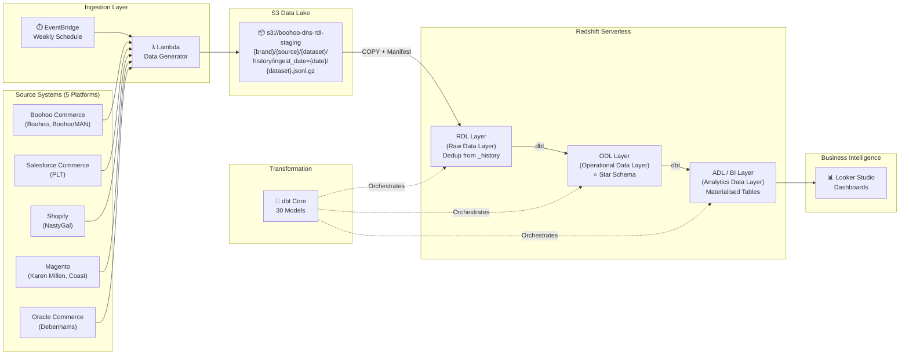
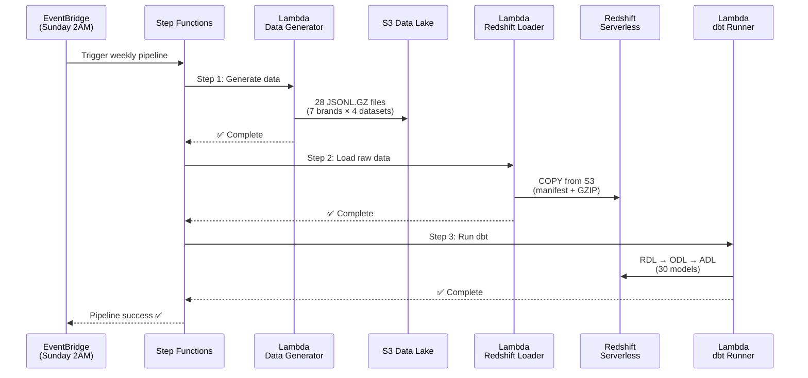
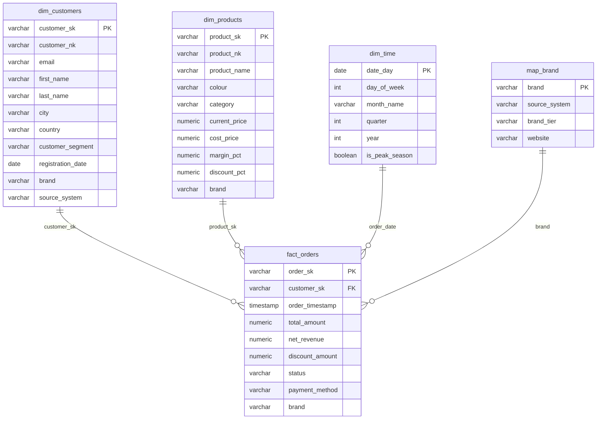
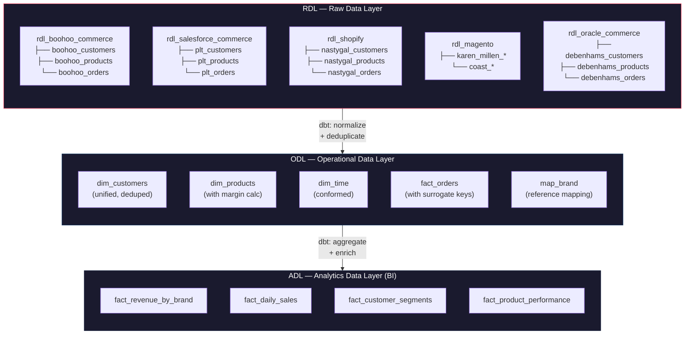

<](https://aws.amazon.com/)
[](https://www.getdbt.com/)
[](https://aws.amazon.com/redshift/)
[](https://www.python.org/)

*A production-grade data engineering pipeline that ingests data from 7 fashion brands — each running a different e-commerce platform — normalises heterogeneous schemas through a 3-layer DWH architecture, and delivers unified analytics.*

---

[Architecture](#-architecture) · [Data Model](#-data-model) · [DWH Layers](#-dwh-layers-rdl--odl--adl) · [Tech Stack](#%EF%B8%8F-tech-stack) · [Quick Start](#-quick-start)

</div>

---

## 📐 Architecture



### Orchestration Flow



---

## 📊 Data Model

### Multi-Brand Portfolio

This pipeline simulates a real-world enterprise challenge: **7 acquired brands** running on **5 different e-commerce platforms**, each with its own schema conventions.

| Brand | Source System | Schema Style | Volume |
|-------|-------------|-------------|--------|
| **Boohoo** | Boohoo Commerce (Custom) | `sku`, `selling_price`, `order_id` | 1,500 customers · 150 SKUs · 15K orders |
| **BoohooMAN** | Boohoo Commerce (Custom) | `sku`, `selling_price`, `order_id` | 800 · 80 · 8K |
| **PrettyLittleThing** | Salesforce Commerce Cloud | `product_id`, `price_book_price`, `order_no` | 1,200 · 120 · 12K |
| **NastyGal** | Shopify | `variant_id`, `price`, `id` | 600 · 60 · 6K |
| **Karen Millen** | Magento | `entity_id`, `price`, `increment_id` | 400 · 50 · 4K |
| **Coast** | Magento | `entity_id`, `price`, `increment_id` | 300 · 40 · 3K |
| **Debenhams** | Oracle Commerce | `item_id`, `list_price`, `order_number` | 700 · 80 · 7K |

> **The DWH challenge:** Each platform uses completely different field names for the same concept. The RDL layer normalises these into a single unified schema.

### Star Schema (ODL)



---

## 🏛️ DWH Layers (RDL → ODL → ADL)

Following enterprise data warehouse conventions:



| Layer | Schema | Purpose | Models |
|-------|--------|---------|--------|
| **RDL** | `rdl_{source_name}` | Raw data deduplication from `_history` tables. Source-specific field names preserved, then aliased to unified names. | 21 |
| **ODL** | `odl` | Star schema with surrogate keys (`_sk`), natural keys (`_nk`), conformed dimensions, and calculated metrics. | 5 |
| **ADL** | `bi` | Pre-aggregated materialized tables optimised for BI tool queries. Joins facts with dimensions. | 4 |

### Schema Normalization Example

The same "product ID" concept has 5 different field names across source systems:

```sql
-- Boohoo Commerce:   sku           → product_id
-- Salesforce (SFCC):  product_id    → product_id  
-- Shopify:            variant_id    → product_id
-- Magento:            entity_id     → product_id
-- Oracle Commerce:    item_id       → product_id
```

---

## 🗂️ S3 Data Lake Structure

Following enterprise naming conventions:

```
s3://boohoo-dns-rdl-staging/
├── boohoo/
│   └── boohoo_commerce/
│       ├── customers/history/ingest_date=2026-05-09/customers.jsonl.gz
│       ├── products/history/ingest_date=2026-05-09/products.jsonl.gz
│       ├── orders/history/ingest_date=2026-05-09/orders.jsonl.gz
│       └── order_items/history/ingest_date=2026-05-09/order_items.jsonl.gz
├── prettylittlething/
│   └── salesforce_commerce/
│       └── ...
├── nastygal/
│   └── shopify/
│       └── ...
├── karen_millen/
│   └── magento/
│       └── ...
├── coast/
│   └── magento/
│       └── ...
└── debenhams/
    └── oracle_commerce/
        └── ...
```

**Path pattern:** `{brand}/{source}/{dataset}/history/ingest_date={yyyy-mm-dd}/{dataset}.jsonl.gz`

---

## 🛠️ Tech Stack

| Layer | Technology | Purpose |
|-------|-----------|---------|
| **Orchestration** | EventBridge + Step Functions | Weekly scheduling + pipeline state management |
| **Compute** | AWS Lambda (Python 3.12) | Data generation, loading, dbt execution |
| **Storage** | Amazon S3 (JSONL.GZ) | Partitioned data lake with Hive-style paths |
| **Warehouse** | Redshift Serverless | Auto-scaling columnar analytics engine |
| **Transformation** | dbt Core | 30 SQL models across 3 layers (RDL/ODL/ADL) |
| **Infrastructure** | AWS CDK (Python) | Infrastructure as Code |
| **CI/CD** | GitHub Actions | Automated deployment on merge |
| **BI** | Google Looker Studio | Interactive dashboards connected to ADL |
| **Showcase** | Apache Airflow DAG | Portfolio demonstration of orchestration skills |

---

## 📁 Project Structure

```
boohoo-data-pipeline/
│
├── 📂 lambda/
│   ├── data_generator/              # Synthetic data for 7 brands × 4 datasets
│   │   ├── config.py                # Brand-source mapping + schema definitions
│   │   └── handler.py               # Generator with realistic distributions
│   └── redshift_loader/
│       └── handler.py               # COPY from S3 with manifest files
│
├── 📂 dbt/
│   ├── dbt_project.yml              # Layer → schema mapping
│   ├── profiles.yml                 # Redshift connection
│   ├── packages.yml                 # dbt_utils dependency
│   └── models/
│       ├── rdl/                     # 🔴 Raw Data Layer (21 models)
│       │   ├── boohoo_commerce/     #    sku → product_id
│       │   ├── salesforce_commerce/ #    product_id → product_id
│       │   ├── shopify/             #    variant_id → product_id
│       │   ├── magento/             #    entity_id → product_id
│       │   └── oracle_commerce/     #    item_id → product_id
│       ├── odl/                     # 🔵 Operational Data Layer (5 models)
│       │   ├── dim/                 #    dim_customers, dim_products, dim_time
│       │   ├── fact/                #    fact_orders
│       │   └── map/                 #    map_brand
│       └── adl/bi/                  # 🟢 Analytics Data Layer (4 models)
│                                    #    fact_revenue_by_brand, fact_daily_sales
│                                    #    fact_customer_segments, fact_product_performance
│
├── 📂 airflow/
│   └── dags/
│       └── boohoo_weekly_pipeline.py # Showcase DAG with TaskGroups
│
├── 📂 cdk/
│   ├── app.py                       # CDK entry point
│   └── stacks/
│       └── data_pipeline_stack.py   # Lambda, S3, Redshift, EventBridge
│
├── 📂 sql/
│   ├── create_tables.sql            # Redshift DDL
│   └── create_views.sql             # Analytical views
│
├── 📂 scripts/
│   ├── deploy.sh                    # One-command deployment
│   ├── teardown.sh                  # Clean resource removal
│   └── generate_dbt_models.py       # Model generator utility
│
└── 📂 docs/
    └── looker_studio_setup.md       # BI connection guide
```

---

## 🚀 Quick Start

```bash
# 1. Clone the repository
git clone https://github.com/TimiOlayinka/boohoo-data-pipeline.git
cd boohoo-data-pipeline

# 2. Install dependencies
pip install -r requirements.txt

# 3. Configure AWS credentials
aws configure sso  # or set AWS_PROFILE

# 4. Deploy infrastructure
cdk bootstrap && cdk deploy

# 5. Generate initial data load
python lambda/data_generator/handler.py

# 6. Run dbt models
cd dbt && dbt deps && dbt run && dbt test
```

---

## 💰 Cost Estimate

| Service | Monthly Cost | Notes |
|---------|-------------|-------|
| S3 (< 50MB) | ~$0.01 | JSONL.GZ compressed |
| Lambda (4 functions, weekly) | ~$0.00 | Free tier |
| Redshift Serverless (8 RPU) | ~$0.50–2.00 | Auto-pauses after 5 min idle |
| Step Functions | ~$0.00 | 4 transitions/week |
| EventBridge | $0.00 | 1 scheduled rule |
| Secrets Manager | $0.40 | 1 secret |
| **Total** | **~$1–3/month** | |

---

## 🗺️ Roadmap

- [x] Multi-brand data generator (7 brands, 5 source systems)
- [x] S3 data lake with Hive-style partitioning
- [x] dbt project (30 models: RDL → ODL → ADL)
- [x] Airflow DAG (portfolio showcase)
- [ ] Redshift Serverless provisioning
- [ ] COPY + manifest ingestion pipeline
- [ ] Step Functions orchestrator
- [ ] EventBridge weekly schedule
- [ ] Looker Studio dashboards
- [ ] GitHub Actions CI/CD

---

<div align="center">

**Built by [Timi Olayinka](https://github.com/TimiOlayinka)** · Data Engineering & AI Automation

</div>
]]>
