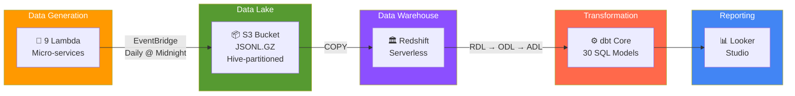
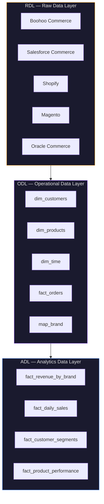

<p align="center">
  <h1 align="center">Boohoo Group — Enterprise Data Pipeline</h1>
  <p align="center">
    <strong>End-to-end data platform built on AWS, deployed with Terraform, transformed with dbt, and visualised in Looker Studio.</strong>
  </p>
  <p align="center">
    
    
    
    
    
    
    
  </p>
</p>

---

## Architecture Overview

This project simulates a **production-grade marketing analytics platform** for Boohoo Group — a multi-brand fashion conglomerate operating 7 brands across 5 different e-commerce platforms. The entire cloud environment is defined as **Infrastructure as Code** using Terraform, deployed via **GitHub Actions CI/CD**, and follows a **three-layer data warehouse** pattern (RDL → ODL → ADL).



---

## Tech Stack

| Layer | Technology | Purpose |
|-------|-----------|---------|
| **Infrastructure** | Terraform | All AWS resources defined as code |
| **CI/CD** | GitHub Actions | Automated build, plan, and deploy on merge to `main` |
| **Compute** | AWS Lambda (Python 3.11) | 9 micro-services for synthetic data generation |
| **Scheduling** | Amazon EventBridge | Daily cron triggers at midnight UTC |
| **Storage** | Amazon S3 | Hive-partitioned data lake (`JSONL.GZ`) |
| **Warehouse** | Redshift Serverless | Auto-scaling columnar analytics engine |
| **Transformation** | dbt Core | 30 SQL models across 3 warehouse layers |
| **BI** | Google Looker Studio | Executive dashboards from the ADL |

---

## Project Structure

```
boohoo-data-pipeline/
│
├── .github/workflows/
│   └── deploy_lambdas.yml          # CI/CD: Build → Terraform Init → Apply
│
├── boohoo/
│   ├── lambda/                     # 9 independent data generators
│   │   ├── ecommerce_customers/
│   │   ├── ecommerce_orders/
│   │   ├── ecommerce_products/
│   │   ├── marketing_meta_ads/
│   │   ├── marketing_google_ads/
│   │   ├── marketing_tiktok_ads/
│   │   ├── marketing_ga4_sessions/
│   │   ├── marketing_email_campaigns/
│   │   ├── marketing_influencers/
│   │   └── shared/                 # Shared utilities & config
│   │       ├── config/
│   │       │   ├── core.py
│   │       │   ├── ecommerce.py
│   │       │   └── marketing.py
│   │       ├── handler_logic.py
│   │       └── utils.py
│   │
│   ├── terraform/                  # Infrastructure as Code
│   │   ├── main.tf                 # Provider & backend config
│   │   ├── iam.tf                  # IAM roles & policies
│   │   ├── lambdas.tf              # 9 Lambda function definitions
│   │   ├── eventbridge.tf          # Daily scheduling rules
│   │   ├── s3.tf                   # S3 buckets & lifecycle policies
│   │   ├── redshift.tf             # Redshift Serverless cluster
│   │   ├── variables.tf            # Input variables
│   │   └── outputs.tf              # Resource outputs
│   │
│   ├── dbt/                        # Data transformation layer
│   │   ├── models/
│   │   │   ├── rdl/                # Raw Data Layer (21 models)
│   │   │   ├── odl/                # Operational Data Layer (5 models)
│   │   │   └── adl/                # Analytics Data Layer (4 models)
│   │   └── dbt_project.yml
│   │
│   ├── sql/                        # DDL & view definitions
│   │   ├── create_tables.sql
│   │   └── create_views.sql
│   │
│   └── scripts/
│       └── build_zips.py           # Packages Lambda code for Terraform
│
└── README.md
```

---

## Data Warehouse Layers

The warehouse follows an enterprise **RDL → ODL → ADL** pattern:



| Layer | Schema | Purpose | Models |
|-------|--------|---------|--------|
| **RDL** | `rdl_{source}` | Raw data deduplication. Source field names aliased to unified schema. | 21 |
| **ODL** | `odl` | Star schema with surrogate keys (`_sk`), conformed dimensions, calculated metrics. | 5 |
| **ADL** | `bi` | Pre-aggregated materialised tables optimised for dashboard performance. | 4 |

---

## Multi-Brand Challenge

This pipeline simulates a real-world enterprise challenge: **7 acquired brands** running on **5 different e-commerce platforms**, each with its own schema conventions.

| Brand | Source System | ID Field | Price Field |
|-------|-------------|----------|------------|
| **Boohoo** | Boohoo Commerce | `sku` | `selling_price` |
| **BoohooMAN** | Boohoo Commerce | `sku` | `selling_price` |
| **PrettyLittleThing** | Salesforce Commerce | `product_id` | `price_book_price` |
| **NastyGal** | Shopify | `variant_id` | `price` |
| **Karen Millen** | Magento | `entity_id` | `price` |
| **Coast** | Magento | `entity_id` | `price` |
| **Debenhams** | Oracle Commerce | `item_id` | `list_price` |

> The RDL layer normalises these into a single unified schema before the data enters the star schema.

---

## Terraform Infrastructure

All AWS resources are declaratively managed via Terraform with remote state stored in S3:

| Resource | Terraform File | Description |
|----------|---------------|-------------|
| AWS Provider & S3 Backend | `main.tf` | Provider config, remote state |
| IAM Role | `iam.tf` | `BoohooDataGeneratorRole` with Lambda & S3 permissions |
| 9 Lambda Functions | `lambdas.tf` | Micro-service data generators using `for_each` |
| 9 EventBridge Rules | `eventbridge.tf` | Daily midnight cron schedules |
| S3 Buckets | `s3.tf` | Data lake with versioning & lifecycle policies |
| Redshift Serverless | `redshift.tf` | Auto-scaling warehouse (auto-pauses when idle) |

---

## S3 Data Lake Structure

```
s3://boohoo-dns-rdl-staging/
├── boohoo/boohoo_commerce/
│   ├── customers/history/ingest_date=2026-05-09/customers.jsonl.gz
│   ├── products/history/ingest_date=2026-05-09/products.jsonl.gz
│   ├── orders/history/ingest_date=2026-05-09/orders.jsonl.gz
│   └── order_items/history/ingest_date=2026-05-09/order_items.jsonl.gz
├── prettylittlething/salesforce_commerce/...
├── nastygal/shopify/...
├── karen_millen/magento/...
├── coast/magento/...
└── debenhams/oracle_commerce/...
```

**Path pattern:** `{brand}/{source}/{dataset}/history/ingest_date={yyyy-mm-dd}/{dataset}.jsonl.gz`

---

## CI/CD Pipeline

Every push to `main` triggers an automated deployment via GitHub Actions:


Branch protection rules enforce that **all changes must go through a Pull Request** — no direct pushes to `main` are permitted.

---

## Quick Start

```bash
# Clone
git clone https://github.com/TimiOlayinka/boohoo-data-pipeline.git
cd boohoo-data-pipeline

# Build Lambda packages
python boohoo/scripts/build_zips.py

# Deploy infrastructure (requires AWS credentials)
cd boohoo/terraform
terraform init
terraform plan
terraform apply

# Run dbt transformations
cd ../dbt && dbt deps && dbt run && dbt test
```

---

## Cost Estimate

| Service | Monthly | Notes |
|---------|---------|-------|
| S3 | ~$0.01 | < 50MB JSONL.GZ |
| Lambda | $0.00 | 270 invocations/month (Free Tier: 1M) |
| EventBridge | $0.00 | Scheduled rules are free |
| Redshift Serverless | ~$0.50–2.00 | Auto-pauses when idle |
| **Total** | **~$1–3/month** | |

---

**Built by [Timi Olayinka](https://github.com/TimiOlayinka)** — Data Engineering & AI Automation
